# GymEntry — Пропускная система для спортзала

  
Пропускная система для спортзала с JWT-авторизацией, подтверждением входа по email и real-time аналитикой в админ-панели. Реализована на микросервисной архитектуре с асинхронным взаимодействием через Kafka, кэшированием, многопоточностью, интеграционными тестами и деплоем в Kubernetes.

подробнее
  
 
<table>
  <thead>
    <tr>
      <th width="30%">Функциональный блок</th>
      <th width="70%">Описание и возможности</th>
    </tr>
  </thead>
  <tbody>
    <tr>
      <td><b>Проход в зал</b></td>
      <td>
        Пользователь нажимает кнопку <b>«Войти»</b> — система генерирует одноразовый код действительный в течении 5 минут. Код диктуется администратору на входе, тот подтверждает проход через панель. Посещение автоматически списывается с активного абонемента.
      </td>
    </tr>
    <tr>
      <td><b>Управление абонементами</b></td>
      <td>
        Покупка абонементов через маркет с интерактивным слайдером количества занятий и расчётом итоговой стоимости в реальном времени. Одновременно активен только один абонемент — переключение между купленными в один клик.
      </td>
    </tr>
    <tr>
      <td><b>Панель администратора</b></td>
      <td>
        <b>Аналитика за произвольный период</b> по конкретному залу. Статистика посещений: кол-во, среднее в день, пик, графики по дням и типам абонементов. Статистика покупок: выручка, средний чек, пик, графики по дням и тарифам. Управление тарифами — изменение цен мгновенно отражается в маркете.
      </td>
    </tr>
    <tr>
      <td><b>Микросервис оплаты</b></td>
      <td>
        Покупка абонемента публикует событие в <b>Kafka</b>. Payment-микросервис обрабатывает его асинхронно и независимо от основного приложения — слабая связность и устойчивость к временной недоступности платёжного сервиса.
      </td>
    </tr>
    <tr>
      <td><b>DevOps & CI/CD</b></td>
      <td>
        Принцип <b>Cloud Native</b>. При Pull Request — автоматический билд и тесты через <b>GitHub Actions</b>. При пуше в <code>main</code> — автодеплой в <b>Kubernetes</b>. Фронтенд и бэкенд в одном кластере.
      </td>
    </tr>
    <tr>
      <td><b>Качество и тестирование</b></td>
      <td>
        Стабильность подтверждена Unit и интеграционными тестами с <b>TestContainers</b> — реальные PostgreSQL и Redis в контейнерах без моков инфраструктуры. Асинхронные сценарии верифицированы через <b>Awaitility</b>.
          - <b>Service+Facade Layer:</b> 84%
          - <b>Controller Layer:</b> 89%
      </td>
    </tr>
  </tbody>
</table>

  
фотки

  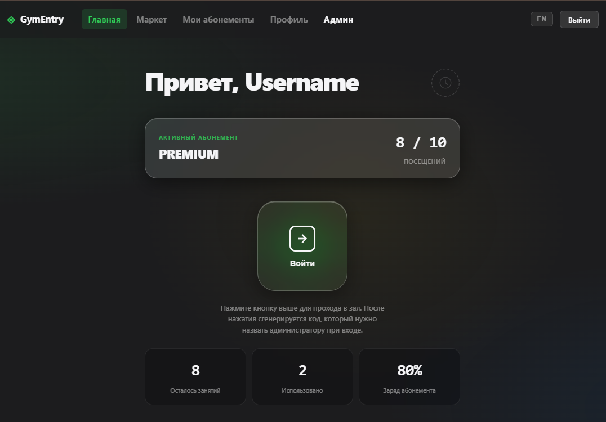 
  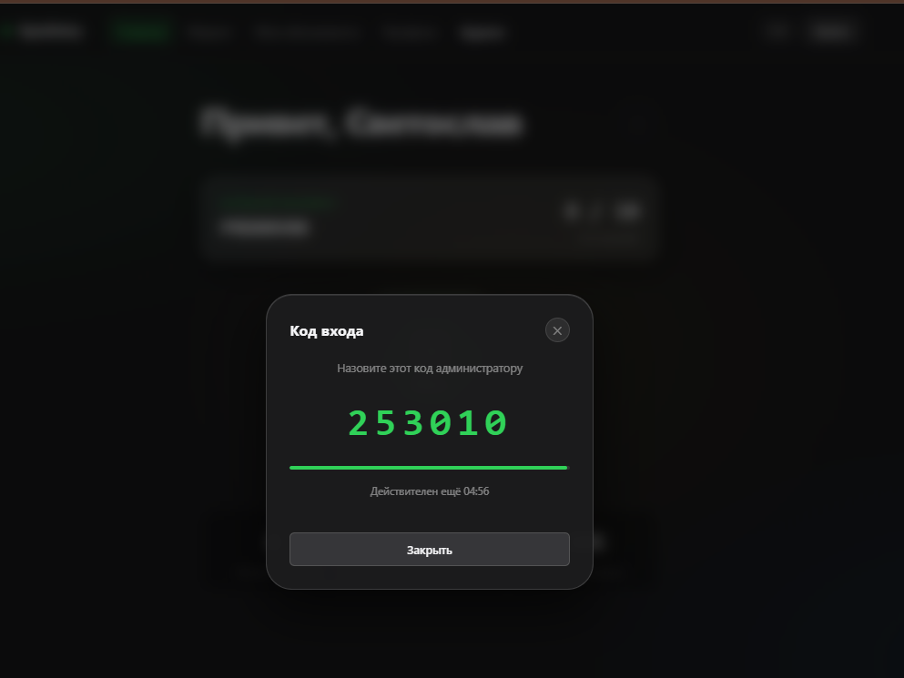 
  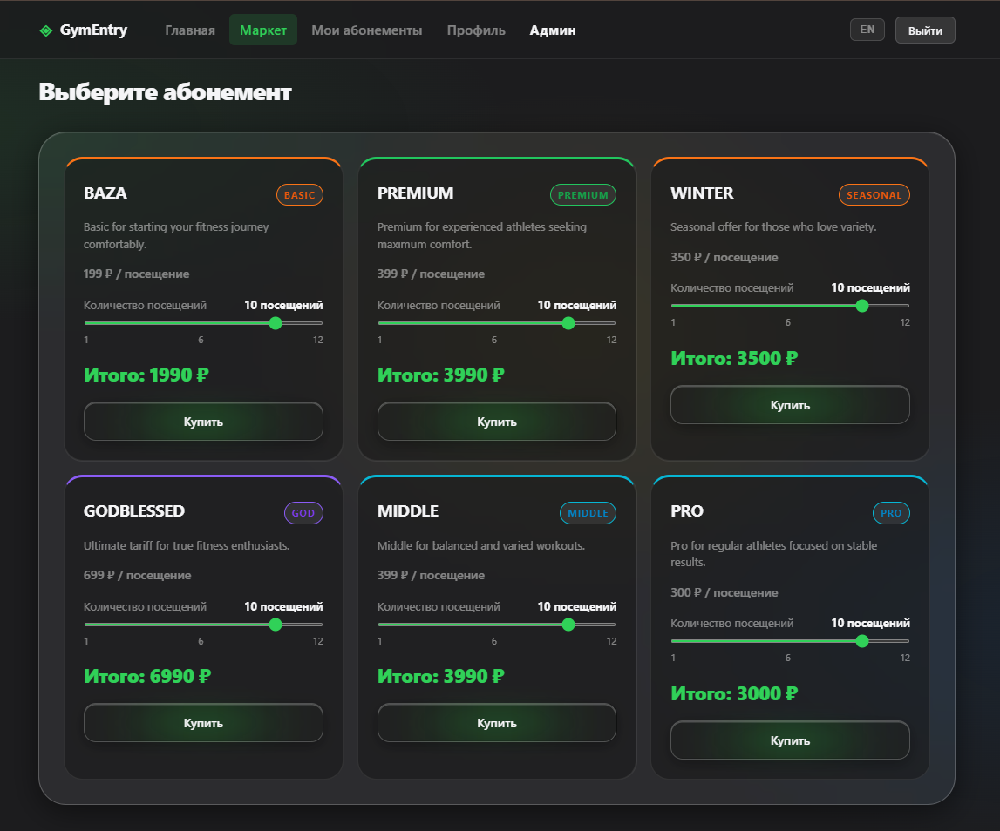 
  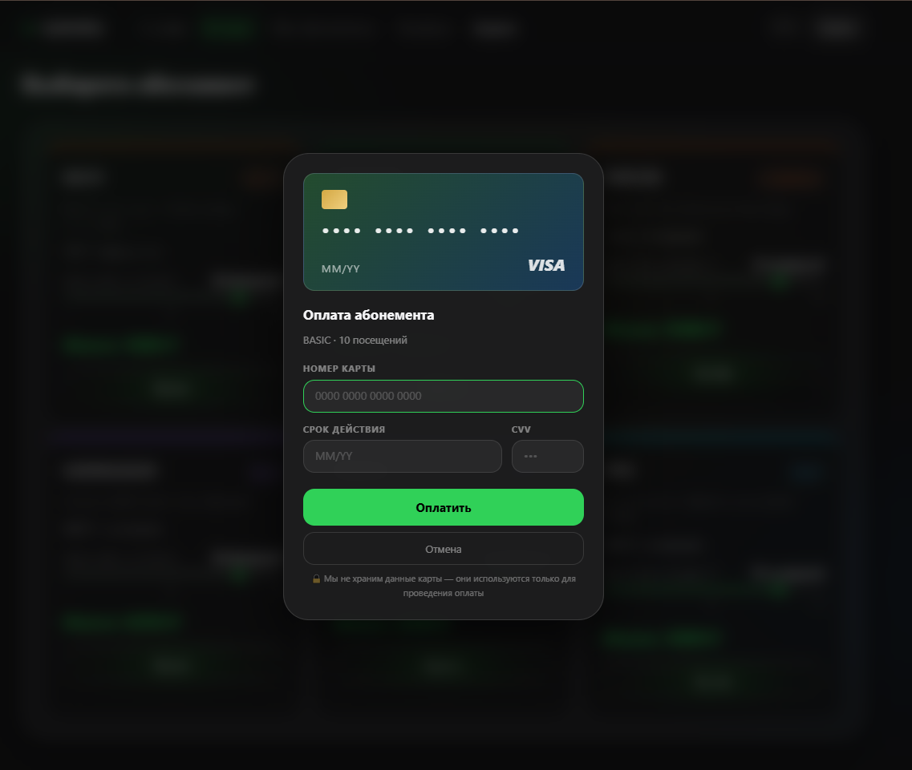 
  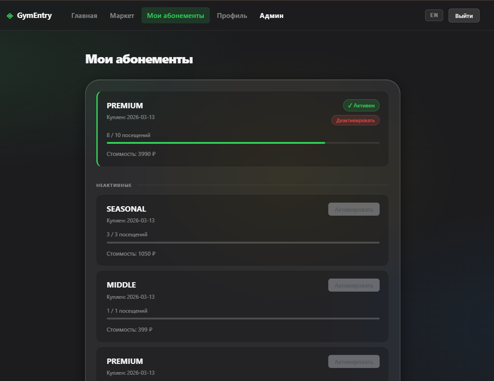 
   
  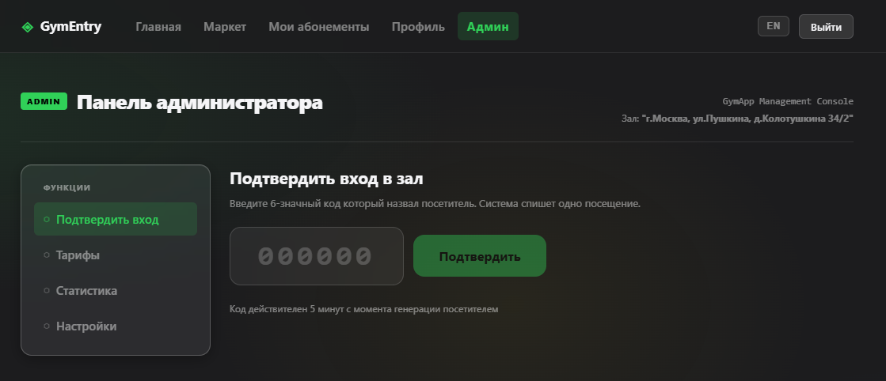 
  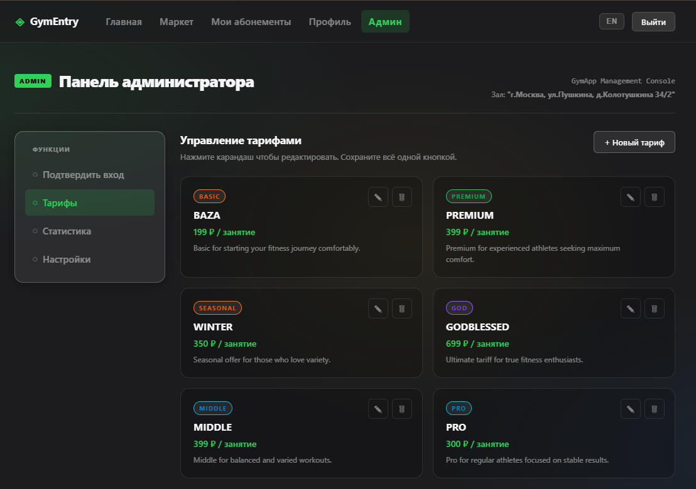 
  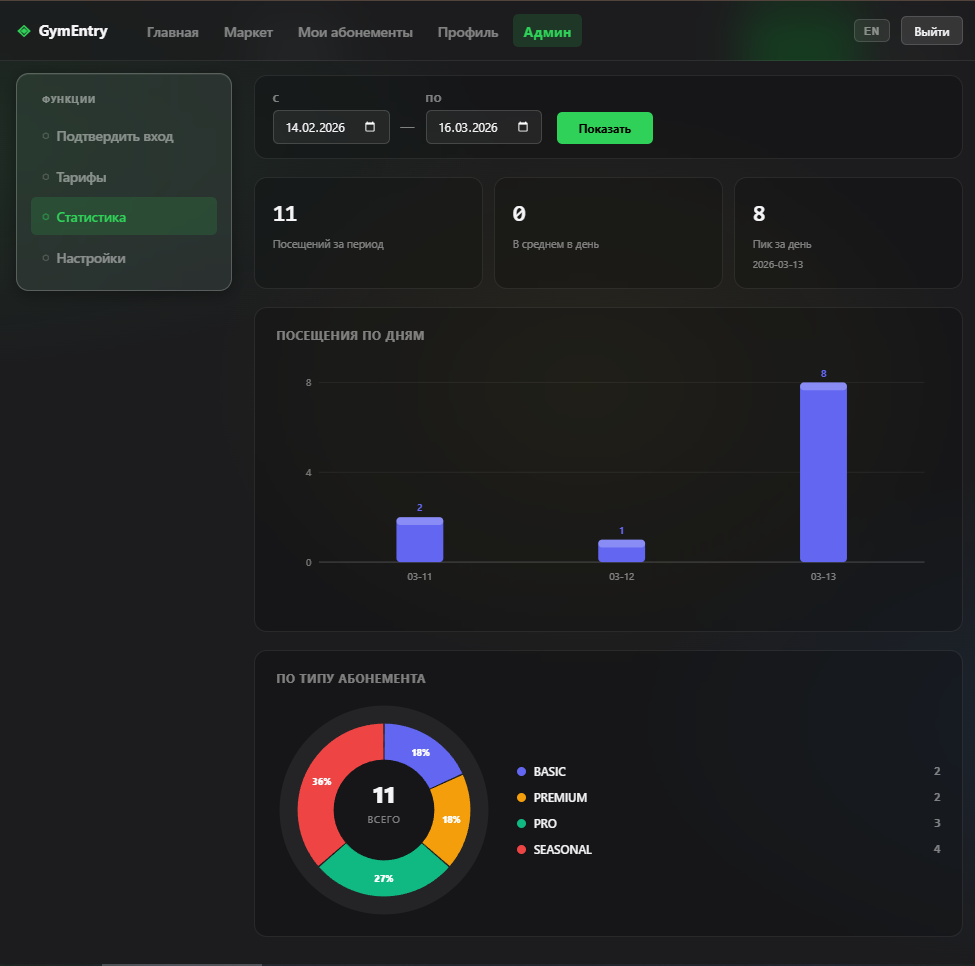 
  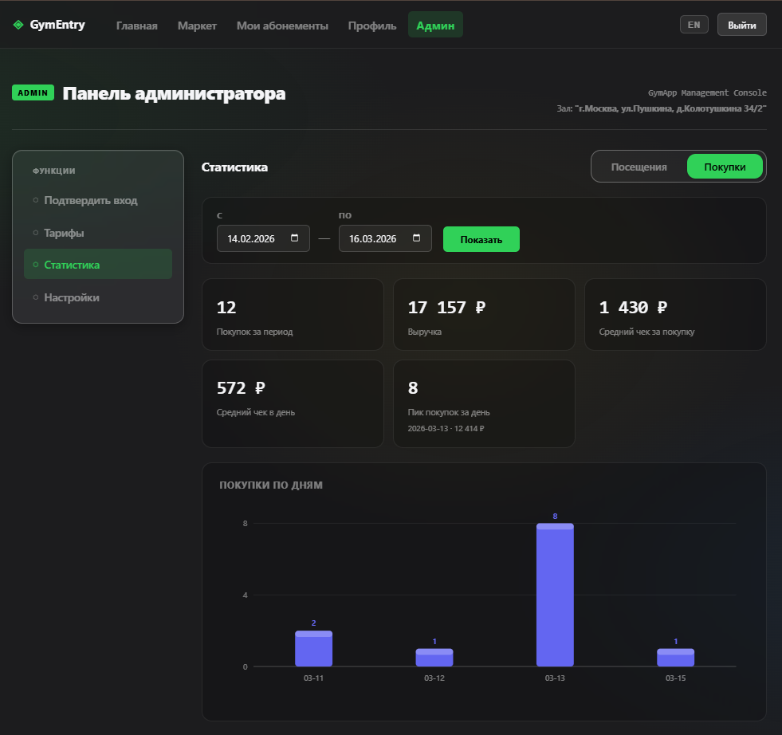 
  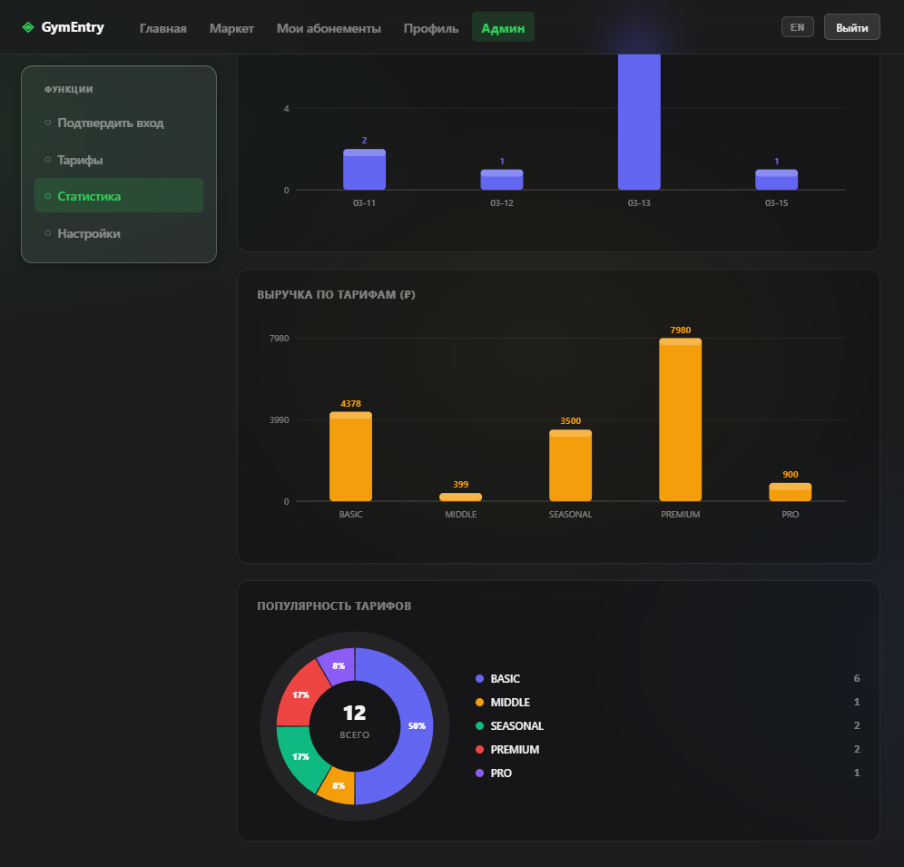 
  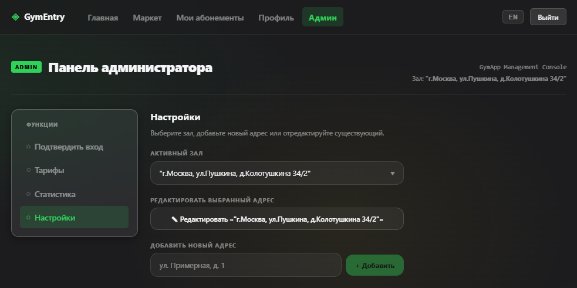 

## 🛠 Технологии
### приложение:
- Spring Boot (Security, Web, Data, Cache, Kafka)
- PostgreSQL
- Redis
- Kubernetes
- Kafka
- Docker
- Liquibase
- Swagger
- Jwt auth
- MapStruct
- GitHub Actions
- Lombok
### тесты:
- JUnit
- Mockito
- TestContainers
- Awaitility

## 🚀 Функциональность

<b>👤 Пользователь</b>

 
<table>
  <thead>
    <tr>
      <th width="25%">Раздел</th>
      <th width="75%">Описание</th>
    </tr>
  </thead>
  <tbody>
    <tr>
      <td><b>Главная</b></td>
      <td>
        Отображает активный абонемент, остаток занятий и процент использования. Кнопка <b>«Войти»</b> генерирует одноразовый код для прохода в зал — пользователь диктует его администратору на входе.
      </td>
    </tr>
    <tr>
      <td><b>Маркет</b></td>
      <td>
        Витрина тарифов с актуальными ценами в реальном времени. Пользователь выбирает тариф, задаёт количество занятий через слайдер — видит итоговую стоимость до покупки. Покупка создаёт абонемент через интеграцию с платёжным микросервисом.
      </td>
    </tr>
    <tr>
      <td><b>Мои абонементы</b></td>
      <td>
        Список всех купленных абонементов с прогресс-баром использования. Одновременно активен только один — именно по нему происходит проход. Можно деактивировать текущий и активировать другой.
      </td>
    </tr>
    <tr>
      <td><b>Профиль</b></td>
      <td>
        Персональные данные (имя, email), метрики: дата регистрации, последний визит, всего посещений.
      </td>
    </tr>
  </tbody>
</table>

<b>🔐 Администратор</b>

 
<table>
  <thead>
    <tr>
      <th width="25%">Раздел</th>
      <th width="75%">Описание</th>
    </tr>
  </thead>
  <tbody>
    <tr>
      <td><b>Подтверждение входа</b></td>
      <td>
        Администратор вводит код, который продиктовал пользователь. Система верифицирует код и фиксирует посещение — списывает занятие с абонемента.
      </td>
    </tr>
    <tr>
      <td><b>Статистика — Посещения</b></td>
      <td>
        За произвольный период: кол-во посещений, среднее в день, пик за день. Графики: посещения по дням, распределение по типу абонемента.
      </td>
    </tr>
    <tr>
      <td><b>Статистика — Покупки</b></td>
      <td>
        За произвольный период: кол-во покупок, выручка, средний чек за покупку, средний чек в день, пик покупок за день. Графики: покупки по дням, выручка по тарифам, популярность тарифов.
      </td>
    </tr>
    <tr>
      <td><b>Тарифы</b></td>
      <td>
        Создание новых тарифов (название, тип, описание, цена за занятие). Изменение цен отражается в маркете у пользователей в реальном времени.
      </td>
    </tr>
    <tr>
      <td><b>Настройки зала</b></td>
      <td>
        Управление информацией о зале: добавление и редактирование адреса. Вся аналитика привязана к конкретному залу — данные не смешиваются между точками сети.
      </td>
    </tr>
  </tbody>
</table>

## ⚙ Технические аспекты и архитектура

<table>
  <thead>
    <tr>
      <th width="28%">Характеристика</th>
      <th width="72%">Реализация</th>
    </tr>
  </thead>
  <tbody>
    <tr>
      <td><b>Безопасность</b></td>
      <td>
        Аутентификация через JWT. Доступ к ресурсам разграничен не только на уровне контроллера, но и на уровне методов <code>@PreAuthorize</code>.Конфиденциальные данные (API-ключи, учетные данные БД) вынесены в переменные окружения с использованием <code>.env.example</code> (в корне) для стандартизации.
      </td>
    </tr>
    <tr>
      <td><b>Kafka + микросервис оплаты</b></td>
      <td>
        Покупка абонемента инициирует асинхронное событие в Kafka. Payment-микросервис обрабатывает его независимо. Такой подход обеспечивает слабую связность и устойчивость к временной недоступности платёжного сервиса.
      </td>
    </tr>
    <tr>
      <td><b>Redis + Graceful Degradation</b></td>
      <td>
        Горячие данные (тарифы, активные абонементы) кэшируются в Redis. При сбое кэша приложение автоматически переключается на прямые запросы к БД — без даунтайма для пользователей.
      </td>
    </tr>
    <tr>
      <td><b>Email-код на вход</b></td>
      <td>
        Коды подтверждения входа отправляются на email. Встроенный Rate Limiter защищает от брутфорса и злоупотреблений — ограничивает частоту генерации кодов на пользователя.
      </td>
    </tr>
    <tr>
      <td><b>Многопоточность</b></td>
      <td>
        Ключевые асинхронные сценарии (обработка событий Kafka, отправка email) выполняются в отдельных потоках. Корректность протестирована с помощью <b>Awaitility</b> без гонок и дедлоков.
      </td>
    </tr>
    <tr>
      <td><b>Миграции БД</b></td>
      <td>
        Схема базы данных версионируется через <b>Liquibase</b>. Применяется автоматически при старте приложения — воспроизводимое состояние БД в любом окружении.
      </td>
    </tr>
    <tr>
      <td><b>CI/CD</b></td>
      <td>
        <b>GitHub Actions:</b> при Pull Request — автоматический билд и прогон тестов. При пуше в <code>main</code> — автоматический деплой в <b>Kubernetes</b>. Фронтенд и бэкенд развёртываются в одном кластере.
      </td>
    </tr>
    <tr>
      <td><b>Чистая архитектура</b></td>
      <td>
        Строгое разделение слоёв: Controller → Service → Repository. <b>MapStruct</b> для маппинга между Entity/DTO без ручного кода. <b>Lombok</b> устраняет бойлерплейт.
      </td>
    </tr>
  </tbody>
</table>
