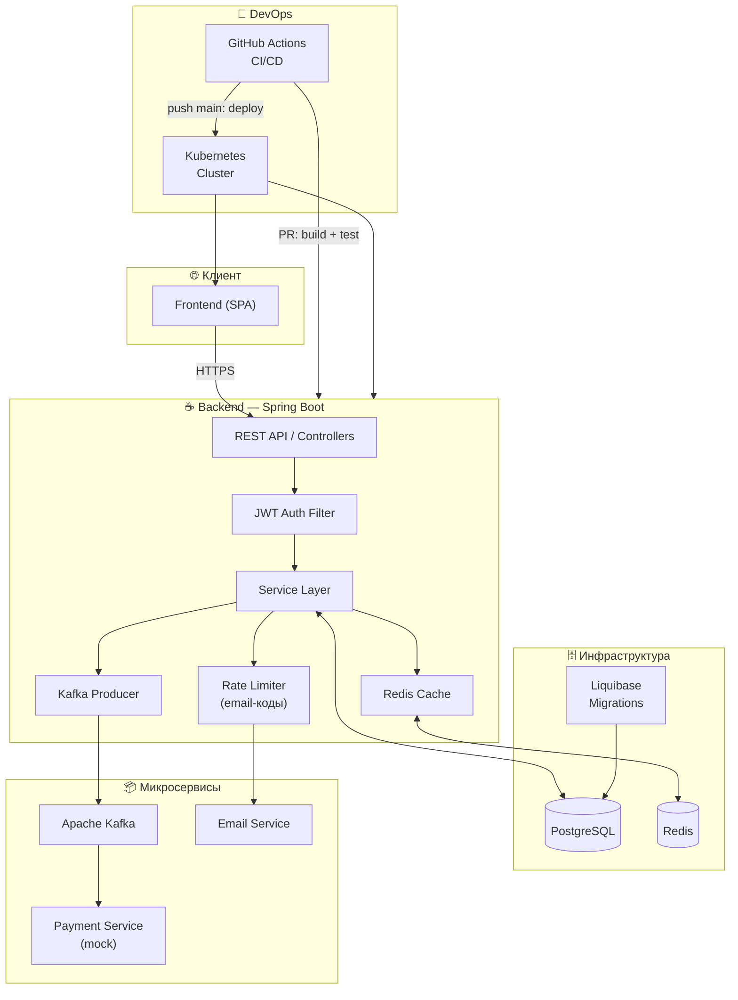

# GymEntry — Пропускная система для спортзала


Полноценная **production-ready** пропускная система для сети спортзалов. Пользователь заходит на сайт, нажимает «Войти» — получает одноразовый код, диктует его администратору на входе. Администратор подтверждает вход через свою панель. Никаких карт, никаких турникетов — только браузер и код.

> **За этим простым UX скрывает** JWT-авторизация, Redis-кэширование, Rate Limiter на email-коды, асинхронное взаимодействие с микросервисом оплаты через Kafka, деплой в Kubernetes и полный CI/CD pipeline на GitHub Actions.

---

## 🖼 Скриншоты

<table>
  <tr>
    <td><b>Главная — активный абонемент и кнопка входа</b></td>
    <td><b>Маркет — выбор тарифа</b></td>
  </tr>
  <tr>
    <td></td>
    <td></td>
  </tr>
  <tr>
    <td><b>Мои абонементы</b></td>
    <td><b>Профиль пользователя</b></td>
  </tr>
  <tr>
    <td></td>
    <td></td>
  </tr>
  <tr>
    <td colspan="2"><b>Панель администратора — статистика и аналитика</b></td>
  </tr>
  <tr>
    <td colspan="2"></td>
  </tr>
</table>

---

## ⚙️ Архитектура



---

## 🚀 Функциональность

<details>
<summary><b>👤 Пользователь</b></summary>
<br>
<table>
  <thead>
    <tr>
      <th width="25%">Раздел</th>
      <th width="75%">Описание</th>
    </tr>
  </thead>
  <tbody>
    <tr>
      <td><b>Главная</b></td>
      <td>
        Отображает активный абонемент, остаток занятий и процент использования. Кнопка <b>«Войти»</b> генерирует одноразовый код для прохода в зал — пользователь диктует его администратору на входе.
      </td>
    </tr>
    <tr>
      <td><b>Маркет</b></td>
      <td>
        Витрина тарифов с актуальными ценами в реальном времени. Пользователь выбирает тариф, задаёт количество занятий через слайдер — видит итоговую стоимость до покупки. Покупка создаёт абонемент через интеграцию с платёжным микросервисом.
      </td>
    </tr>
    <tr>
      <td><b>Мои абонементы</b></td>
      <td>
        Список всех купленных абонементов с прогресс-баром использования. Одновременно активен только один — именно по нему происходит проход. Можно деактивировать текущий и активировать другой.
      </td>
    </tr>
    <tr>
      <td><b>Профиль</b></td>
      <td>
        Персональные данные (имя, email), метрики: дата регистрации, последний визит, всего посещений.
      </td>
    </tr>
  </tbody>
</table>
</details>

<details>
<summary><b>🔐 Администратор</b></summary>
<br>
<table>
  <thead>
    <tr>
      <th width="25%">Раздел</th>
      <th width="75%">Описание</th>
    </tr>
  </thead>
  <tbody>
    <tr>
      <td><b>Подтверждение входа</b></td>
      <td>
        Администратор вводит код, который продиктовал пользователь. Система верифицирует код и фиксирует посещение — списывает занятие с абонемента.
      </td>
    </tr>
    <tr>
      <td><b>Статистика — Посещения</b></td>
      <td>
        За произвольный период: кол-во посещений, среднее в день, пик за день. Графики: посещения по дням, распределение по типу абонемента.
      </td>
    </tr>
    <tr>
      <td><b>Статистика — Покупки</b></td>
      <td>
        За произвольный период: кол-во покупок, выручка, средний чек за покупку, средний чек в день, пик покупок за день. Графики: покупки по дням, выручка по тарифам, популярность тарифов.
      </td>
    </tr>
    <tr>
      <td><b>Тарифы</b></td>
      <td>
        Создание новых тарифов (название, тип, описание, цена за занятие). Изменение цен отражается в маркете у пользователей в реальном времени.
      </td>
    </tr>
    <tr>
      <td><b>Настройки зала</b></td>
      <td>
        Управление информацией о зале: добавление и редактирование адреса. Вся аналитика привязана к конкретному залу — данные не смешиваются между точками сети.
      </td>
    </tr>
  </tbody>
</table>
</details>

---

## 🛠 Стек технологий

### Backend
| Категория | Технологии |
|---|---|
| **Core** | Java 21, Spring Boot 3, Spring Web, Spring Data JPA |
| **Безопасность** | Spring Security, JWT, Rate Limiter (email-коды) |
| **База данных** | PostgreSQL, Liquibase (миграции), MapStruct, Lombok |
| **Кэширование** | Redis (Graceful Degradation при сбое) |
| **Сообщения** | Apache Kafka (интеграция с payment-микросервисом) |
| **DevOps** | Docker, Kubernetes, GitHub Actions CI/CD |
| **Тесты** | JUnit, Mockito, TestContainers, Awaitility, Liquibase |

---

## ⚡ Технические аспекты

<table>
  <thead>
    <tr>
      <th width="28%">Характеристика</th>
      <th width="72%">Реализация</th>
    </tr>
  </thead>
  <tbody>
    <tr>
      <td><b>JWT-авторизация</b></td>
      <td>
        Stateless аутентификация через JWT. Токены верифицируются на уровне Spring Security фильтра до попадания в бизнес-логику. Роли пользователя и администратора разграничены на уровне методов (<code>@PreAuthorize</code>).
      </td>
    </tr>
    <tr>
      <td><b>Kafka + микросервис оплаты</b></td>
      <td>
        Покупка абонемента инициирует асинхронное событие в Kafka. Payment-микросервис обрабатывает его независимо. Такой подход обеспечивает слабую связность и устойчивость к временной недоступности платёжного сервиса.
      </td>
    </tr>
    <tr>
      <td><b>Redis + Graceful Degradation</b></td>
      <td>
        Горячие данные (тарифы, активные абонементы) кэшируются в Redis. При сбое кэша приложение автоматически переключается на прямые запросы к БД — без даунтайма для пользователей.
      </td>
    </tr>
    <tr>
      <td><b>Rate Limiter</b></td>
      <td>
        Коды подтверждения входа отправляются на email. Встроенный Rate Limiter защищает от брутфорса и злоупотреблений — ограничивает частоту генерации кодов на пользователя.
      </td>
    </tr>
    <tr>
      <td><b>Многопоточность</b></td>
      <td>
        Ключевые асинхронные сценарии (обработка событий Kafka, отправка email) выполняются в отдельных потоках. Корректность протестирована с помощью <b>Awaitility</b> без гонок и дедлоков.
      </td>
    </tr>
    <tr>
      <td><b>Миграции БД</b></td>
      <td>
        Схема базы данных версионируется через <b>Liquibase</b>. Применяется автоматически при старте приложения — воспроизводимое состояние БД в любом окружении.
      </td>
    </tr>
    <tr>
      <td><b>CI/CD</b></td>
      <td>
        <b>GitHub Actions:</b> при Pull Request — автоматический билд и прогон тестов. При пуше в <code>main</code> — автоматический деплой в <b>Kubernetes</b>. Фронтенд и бэкенд развёртываются в одном кластере.
      </td>
    </tr>
    <tr>
      <td><b>Чистая архитектура</b></td>
      <td>
        Строгое разделение слоёв: Controller → Service → Repository. <b>MapStruct</b> для маппинга между Entity/DTO без ручного кода. <b>Lombok</b> устраняет бойлерплейт.
      </td>
    </tr>
  </tbody>
</table>

---

## 🧪 Тестирование

| Тип | Инструменты | Описание |
|---|---|---|
| **Unit-тесты** | JUnit 5, Mockito | Покрытие бизнес-логики сервисного слоя |
| **Интеграционные тесты** | TestContainers | Тесты с реальными PostgreSQL и Redis в Docker-контейнерах — максимально близко к продакшену |
| **Асинхронные тесты** | Awaitility | Верификация многопоточных сценариев без Thread.sleep и гонок |
| **Покрытие** |  | *(обновится после снятия метрики)* |

---

## 🚀 Запуск

```bash
# Клонировать репозиторий
git clone https://github.com/your-username/gymentry.git
cd gymentry

# Настроить переменные окружения
cp .env.example .env
# Отредактировать .env — DB, Redis, Kafka, JWT secret, email

# Поднять всё окружение одной командой
docker-compose up --build
```

Приложение будет доступно на `http://localhost:8080`

> **Kubernetes:** манифесты для деплоя находятся в директории `/k8s`. CI/CD pipeline деплоит автоматически при пуше в `main`.
